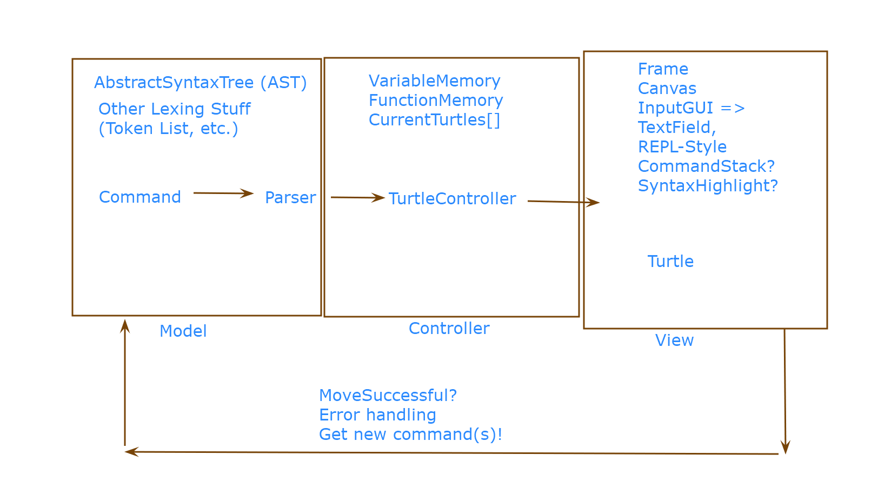

# API Lab Discussion
# SLogo API Design

## Names and NetIDs

Cole Spector (cgs26)

Marc Chmielewski (msc68)

Harrison Huang (hlh38)

David Li (dl303)

### Planning Questions

* What behaviors (methods) should the turtle have?

The turtle has to be able to move, turn, and either draw or not draw when it moves.

* When does parsing need to take place and what does it need to start
  Properly?

We need to be able to parse inputs from both the command line, and an input file.

* What is the result of parsing and who receives it?

The result of the parsing will be sent to the model.

* When are errors detected and how are they reported?

Errors are detected in the parsing, and will be reported in the command line.

* What do commands know, when do they know it, and how do they get it?

The commands themselves know nothing, it is the model which interprets the commands.

* How is the GUI updated after a command has completed execution?

The controller will relay information from the model, and send it to the view which will update accordingly, and will then print a “>” symbol in the consol, prompting for the next command

* What behaviors does the result of a command need to have to be used
  by the front end?

It simply needs to be transformed into a format which specifically states changes to the turtle.

### APIs

#### Backend External API

#### Frontend External API

#### Backend Internal API

#### Frontend Internal API

### Design

#### Backend Design CRCs

#### Frontend Design CRCs

#### Use Cases

* The user types 'fd 50' in the command window, sees the turtle move in the display window leaving a trail, and has the command added to the environment's history.
    * Command is processed ⇒ passed to parser
    * Parser populates AST
    * Output passed to TurtleController, which interprets it accordingly
        * Stores any variables and functions in the appropriate data structures
    * TurtleController alerts Turtle that there’s a new command, and calls the respective function, forward, for an amount of 50 units, with the pen down, and default color.
    * Turtle completes the task and tells the controller that the task is complete.
        * As long as the task completes successfully, the command is added to the history.
    * Controller tells the Parser to get the next command.
* The user types '50 fd' in the command window and sees an error message that the command was not formatted correctly.
    * Command passed to parser
    * The parser populates the AST
    * Output passed to TurtleController, which determines that “50” is not a valid function, so it sends an error to be displayed in the view

* The user types 'pu fd 50 pd fd 50' in the command window and sees the turtle move twice (once without a trail and once with a trail).
    * Command is processed ⇒ passed to parser
    * Parser populates AST
    * Output passed to TurtleController, which interprets it accordingly
        * Stores any variables and functions in the appropriate data structures
    * TurtleController alerts Turtle that there’s a new command, and calls the respective function, forward, for an amount of 50 units, with the pen down, and default color.
    * Turtle completes the task and tells the controller that the task is complete.
        * As long as the task completes successfully, the command is added to the history.
    * Controller tells the Parser to get the next command.
    * Rinse and repeat, only this time with the pen up.
* The user changes the color of the environment's background.

